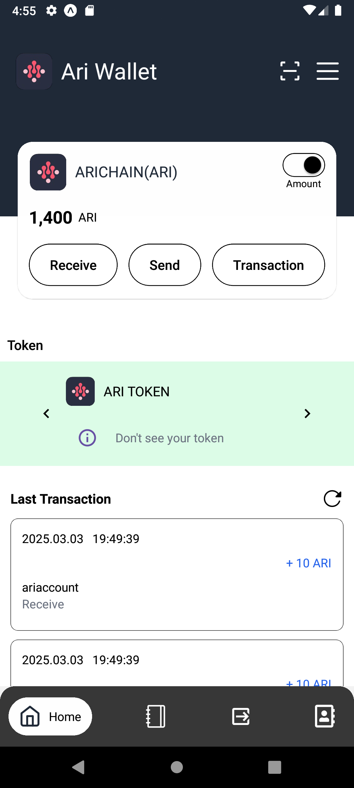
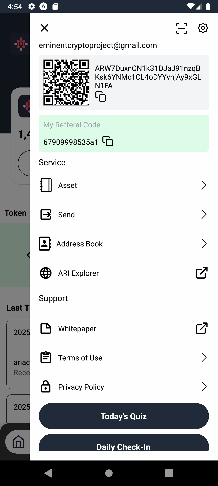
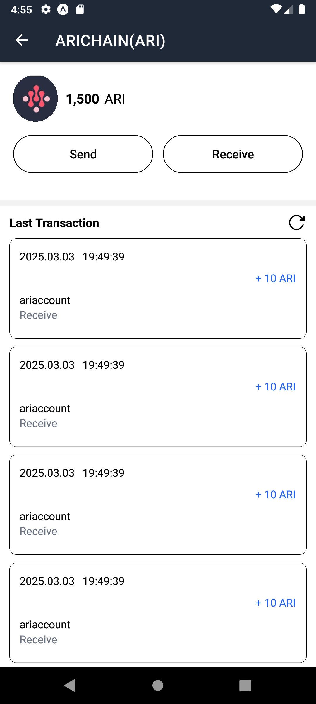
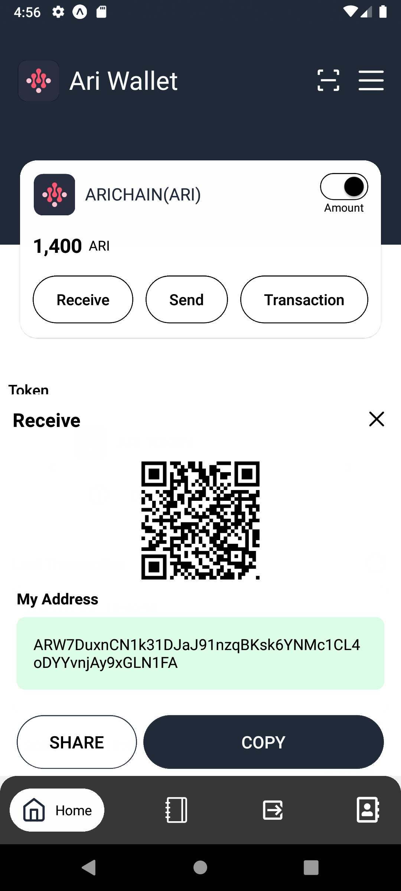
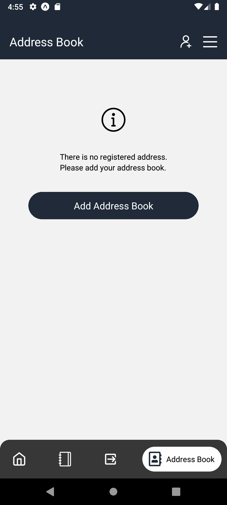
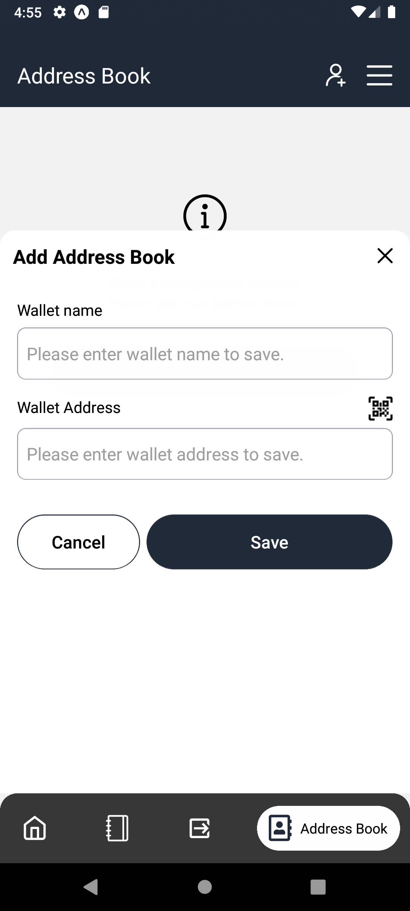
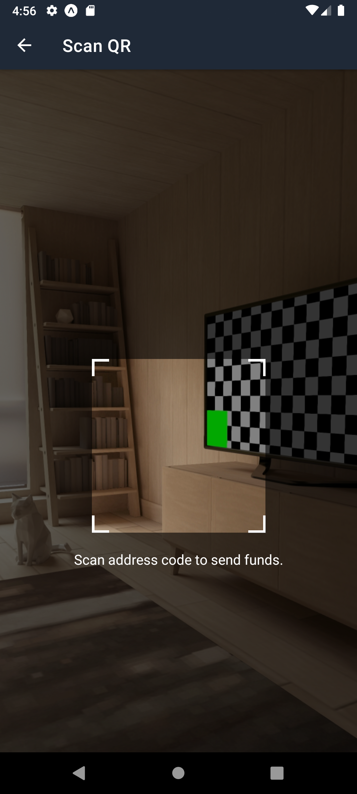
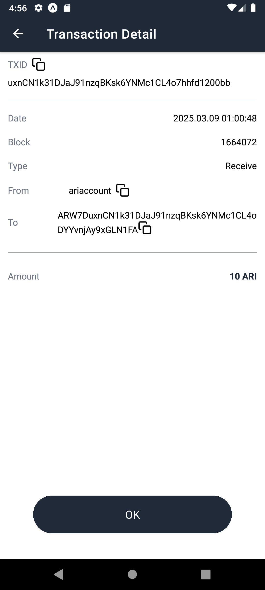

# ARI-Wallet-Mobile 🌟
A modern, user-friendly cryptocurrency wallet built with React Native and Expo. Features QR code scanning, address book management, and seamless transaction handling.

## ✨ Features
📱 Cross-platform (iOS & Android)
🔐 Secure wallet management
📘 Address book with CRUD operations
📷 QR code scanning & generation
🔄 Transaction history
📤 Easy send/receive functionality
🎨 Modern UI with bottom sheets
🌓 Drawer navigation


## 🚀 Tech Stack
React Native
Expo Router
@gorhom/bottom-sheet
Tailwind CSS (NativeWind)
Expo Camera
React Native QR Code

## 📸 Screenshots

### Main Wallet Interface
<div align="center">
  
  <p><strong>Home Screen:</strong> Manage your ARI tokens, view balance, and access quick actions</p>
</div>

<div align="center">
  
  <p><strong>Drawer Menu:</strong> Easy navigation with QR scanner, settings, and wallet management</p>
</div>

### Transaction Features
<div align="center">
  
  <p><strong>Send Tokens:</strong> Transfer ARI tokens with amount input and address selection</p>
</div>

<div align="center">
  
  <p><strong>Receive Modal:</strong> Generate and share your wallet address via QR code</p>
</div>

### Address Book
<div align="center">
  
  <p><strong>Address Book:</strong> Manage your saved wallet addresses with easy CRUD operations</p>
</div>

<div align="center">
  
  <p><strong>Add/Edit Address:</strong> Bottom sheet for adding or updating wallet addresses</p>
</div>

### QR Scanner
<div align="center">
  
  <p><strong>QR Scanner:</strong> Scan wallet addresses with centered capture frame and blur effect</p>
</div>

### Transaction History
<div align="center">
  
  <p><strong>Transaction List:</strong> View your complete transaction history with details</p>
</div>

<div align="center">
  
  <p><strong>Transaction Details:</strong> Detailed view of individual transactions with all metadata</p>
</div>

## 🛠️ Installation
Clone the repository
```git clone https://github.com/yourusername/ARI-Wallet-Mobile.git```

Install dependencies
```
cd ARI-Wallet-Mobile
npm install
```

Start the development server
```npx expo start```

## 📱 Usage
- Launch the app
- Create or import your wallet
- Use the address book to manage contacts
- Send/receive cryptocurrency using QR codes
- View transaction history

## 🏗️ Project Structure
src/
├── app/
│   ├── (drawer)/
│   │   └── (tabs)/
│   └── scan.jsx
├── components/
│   ├── AddBookSheet.jsx
│   ├── AddressBookCard.jsx
│   ├── CustomHeader.jsx
│   └── ...
├── constants/
│   └── data/
└── utils/

## 🤝 Contributing
Contributions are welcome! Please feel free to submit a Pull Request.

## 🙏 Acknowledgments
Expo
React Native
@gorhom/bottom-sheet